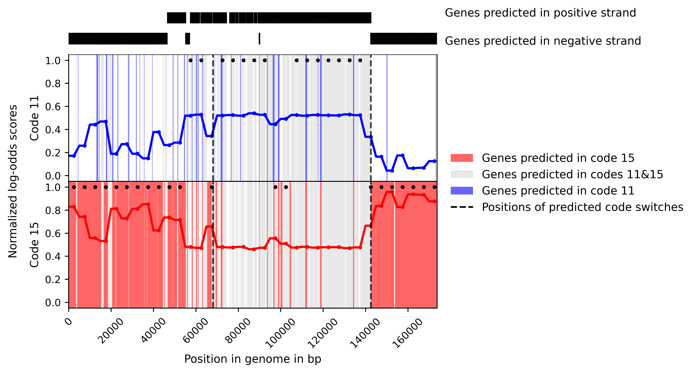

# Mgcod

### Table of Contents

- [Description of Mgcod](#description-of-mgcod)
   - [Prediction of (multiple) genetic code(s)](#prediction-of-multiple-genetic-codes)
   - [Annotation of isoforms](#annotation-of-isoforms)
   - [Analyzing many genomes in parallel](#analyzing-many-genomes-in-parallel)
- [Software requirements](#software-requirements)
   - [Python dependencies](#python-dependencies)
   - [MetaGeneMark](#metagenemark)
- [Output files](#output-files)
- [Usage](#usage)
- [Example usage](#example-usage)
- [References](#references)
- [Citation](#citation)

Mgcod predicts stop codon reassignments in prokaryotic DNA sequences. It can also predict cases of bimodal genetic codes, i.e., in phage 2,R1 which switches from the canonical genetic code to *amber* stop codon reassignment. The genome of phage 2 is provided as an example genome, and was retrieved from the [repository](https://portal.nersc.gov/dna/microbial/prokpubs/recoding/Phage_genomes/) provided by Ivanova et al.

For the prediction of the genetic code, the coding potential of various genetic codes is taken into account. MetaGeneMark (MGM) is used with different genetic code models to find the highest scoring model.R2 Currently, the standard genetic code (`dependencies/mgm_11.mod`) as well as genetic codes with *opal* (TGA) reassignment (`dependencies/mgm_4.mod`), *amber* (TAG) reassignment (`dependencies/mgm_15.mod`) and *ochre* (TAA) reassignment (`dependencies/mgm_101.mod`) are supported.

### Description of Mgcod

#### Prediction of (multiple) genetic code(s)

In the default mode, Mgcod assigns one genetic code to contig included in a multi-FASTA file. However, by setting the `--isoforms` flag it searches for evidence of multiple genetic codes. For the prediction of multiple genetic, a sliding window approach is applied. First, a genetic code is predicted based on the highest scoring genetic code model for each window. Then, a dynamic programming approach is applied to merge blocks of windows with the same genetic code that are interrupted by only a few windows with a different genetic code. This is done to avoid the segementation of the genome into too many genetic codes. After blocks with distinct genetic codes are identified, it searched for a change in protein-encoding strand (PES) within the two windows between which the genetic code changes. If a change of PES is found then the intergenic region separating the two genes between which the PES switches is annotated as the switch region. If no PES switch is observed, the intergenic region separating the two windows between which the switch of genetic code occurs is annotated as switch region. The reasoning for using PES information to refine the prediction of genetic code switch region is given by the observed PES bias in phages with multiple genetic codes that coincides with the usage of genetic codes.R1 By default, a window size of 5000 bp (`-w 5000`) and  stride of 5000 bp (`-st 5000`) is used. We do not recommend to use window size shorter than 5000 bp as the accuracy of Mgcod of determining the correct genetic code declines for shorter sequences. Furthermore, we require at least three consecutive windows with the same genetic code to form a new block (`-n 3`).

#### Annotation of isoforms

We observed that if a genome has multiple genetic codes, the predictions of the two genetic codes models are often indistinguishable in one segment of the genome. Therefore, we annotate those predictions as "isoforms". This is done by comparing the predictions of the genetic code models. i) If model A predicts one long gene that overlaps many short predictions by model B and its coding potential is greater than the accumulated coding potential of the short genes, the prediction of model A is retained and the predictions of model B are dropped. ii) If the predictions of both models are on the same PES and share the stop coordinates or the start coordinates while the stop coordinates differ by less than t nucleotides (by default `-t 30`), the predictions are considered equivalent and are annotated as isoforms. iii) If the predictions of both models are identical, the gene is dual-coded, but only one prediction is included in the final gene set. iv) In all other cases, the predictions of both models are retained and are labeled as unique.

#### Analyzing many genomes in parallel

Mgcod can handle multi-FASTA files and outputs one prediction per contig. However, it should be noted that if a multi-FASTA file with contigs from different genomes with different genetic codes is provided, it is recommended to split the sequences into individual fasta files, and analyze them separately using the provided `multiprocess_mgcod.py` script. The `multiprocess_mgcod.py` script takes as input the path to a text file with which contains the paths to fasta files to be analyzed, with file path per line.

### Software requirements
Running Mgcod requires a Linux system with bash. The following dependencies need to be satsified:

#### Python dependencies:
The code is implemented in Python and was tested with Python version 3.7.3. Additionally, the following libraries are required: 
- pandas v1.2.4
- numpy v1.18.1
- biopython v1.78
- matplotlib v3.2.2
- multiprocess-logging v0.3.1

The code was tested with the above specified version and it is recommend to use these versions if possible. The python dependencies can be conveniently installed from the provided `environment.yml` file: 
`conda create env -f environment.yml`

#### MetaGeneMark
Mgcod uses MetaGeneMark including models for genetic code 11, 4, 15 and 101. Both MetaGeneMark and genetic code models are already included in the `dependencies/` folder. MetaGeneMark is distributed with a different license. Please, agree with license conditions and download corresponding license key file from [http://exon.gatech.edu/GeneMark/license_download.cgi](http://exon.gatech.edu/GeneMark/license_download.cgi).

### Output files
Mgcod creates a series of output files:
- MetaGeneMark predictions: By default, it saves the MetaGeneMark prediction with different genetic codes models in gff format in the folder `mgm_results` (`-p mgm_results`). Each file has prefix indicating the genetic code model, followed by the input file name (`mgm_results/mgm_XX_<input_file>.gff`). Saving the intermediate files allows to re-run Mgcod faster, as MGM does not need to be re-run.

- Final gene annotation in GFF format (*.gff): This file will be saved in the directory specified with the `-o` flag (by default, `results`). This file may include possible isoforms if predicted.
- A file summarizing the predicted genetic codes (*.tab): This file summarizes the type of predicted genetic code for each contig in the provided input file. It also  provides information about the segmentation of the genome, i.e., the boundaries of blocks with distinct genetic codes if multiple genetic codes were observed, and the number of genes/isoforms with given genetic codes in each block.
- A file summarizing the number of recoding events per gene (*_stats.tab): This files provides information about the number of recoding events per gene. If stop codon recpoding were observed it also provides the coordinates and type of recoded stop codons. 
- Nucleotide sequences of predicted protein-coding regions (proteins_nt*.fasta): This file is only generated if the `-NT` flag is set.
- Amino acid sequences of predicted protein-coding regions (proteins_aa*.fasta): This file is only generated if the `-AA` flag is set.
- A figure depicting the segmentation of contig (with multiple genetic codes). This figure will only be generated if a directory for saving plots is specified via the `-m` variable (by default, `-m ./plots/`). The top panel indicates the protein-encoding strand of predicted genes. Below the coding potential of the different genetic code models is shown along the genome, i.e., log-odds ratio. A black dot in a given panel indicates that predictions of the corresponding genetic code model yielded the highest log-odds scores in a window and hence rendered the most accurate predicitons. The shading indicates whether a gene was uniquely predicted by one genetic code model or is dual-coded, i.e., isoform (see the provided figure after the [Example](#example-usage)).

### Usage:  
<pre><code>mgcod.py -h
usage: mgcod.py [-h] -i PATH_TO_GENOME [-p PATH_TO_PREDICTIONS] [-o OUTPUT]
                [-m PATH_TO_PLOTS] [-r] [--isoforms] [-n CONSECUTIVE_WINDOWS]
                [-g CONSECUTIVE_GENE_LABELS] [-w WINDOW_SIZE] [-st STRIDE]
                [-t TOLERANCE] [-d] [-AA] [-NT] [--short_contigs]
                [--logfile LOGFILE] [-v] [--version]

Mgcod segments contigs based on genetic code usage and performs genetic-code-
informed annotation of coding regions using MetaGeneMark. Can be run on any
prokaryotic sequences with(-out) stop codon reassignment

required arguments:
  -i PATH_TO_GENOME, --path_to_genome PATH_TO_GENOME
                        Path to input file, FASTA format

optional arguments:
  -h, --help            show this help message and exit
  -p PATH_TO_PREDICTIONS, --path_to_mgm_predictions PATH_TO_PREDICTIONS
                        Directory where to save MGM predictions so that they
                        can be re-used. If path does not exist, it will be
                        created. [./mgm_results/]
  -o OUTPUT, --path_to_output OUTPUT
                        Directory where to save final gene annotations and
                        supporting outputs. If path does not exist, it will be
                        created. If -AA or -NT flag is set, sequences will be
                        saved here, too. [./results/]
  -m PATH_TO_PLOTS, --path_to_plots PATH_TO_PLOTS
                        Directory where to save plots. Plots logodd ratio per
                        window for different MGM models. Only available with
                        isoform prediction. If path does not exist, it will be
                        created
  -r, --circular        Set if sequence is circular. Only relevant for isoform
                        prediction
  --isoforms            Enable prediction of isoforms
  -n CONSECUTIVE_WINDOWS, --consecutive_windows CONSECUTIVE_WINDOWS
                        Number of consecutive windows to be required with same
                        genetic code to keep. Only relevant for isoform
                        prediction. Minimum is 2. [3]
  -g CONSECUTIVE_GENE_LABELS, --consecutive_gene_labels CONSECUTIVE_GENE_LABELS
                        Number of consecutive gene labels to be required with
                        same genetic code to keep. Only relevant for isoform
                        prediction. Minimum is 2. [5]
  -w WINDOW_SIZE, --window_size WINDOW_SIZE
                        Window size in bp applied to search for isoform. Only
                        relevant for isoform prediction. [5000]
  -st STRIDE, --stride STRIDE
                        Step size in bp, with which window will be moved along
                        sequence. Only relevant for isoform prediction. [5000]
  -t TOLERANCE, --tolerance TOLERANCE
                        The maximally tolerated difference in prediction of
                        gene start or gene stop to consider the prediction of
                        two models isoforms. Only relevent for isoform
                        prediction. [30]
  -d, --delete          Delete intermediary files (prediction of the different
                        MGM models).
  -AA, --amino_acids    Extract amino acid sequences of predicted proteins.
  -NT, --nucleotides    Extract nucleotide sequences of predicted proteins.
  --short_contigs       Predict genetic codes of contigs < 5000bp. Prediction
                        may not be reliable
  --logfile LOGFILE     Path to log file
  -v, --verbose         verbose
  --version             show program's version number and exit
</pre></code>

The usage of `multiprocess_mgcod.py` is exactly the same as for `mgcod.py`, expect it that takes a text file containing paths to fasta file (one per line) specified with `--genomes`. Additionally, the number of CPUs (`--threads`) and the batch size (`--batch_size`) can be specified.

### Example usage
An example run of Mgcod on Phage21 with default settings
<pre><code>mgcod.py -i ./examples/phage2.fasta -r --isoforms -v -m ./plots -p mgm_results/ -o results/
</pre></code>

### References

**R1.** Ivanova, Natalia N, Patrick Schwientek, H James Tripp, Christian Rinke, Amrita Pati, Marcel Huntemann, Axel Visel, Tanja Woyke, Nikos C Kyrpides, and Edward M Rubin. 2014. “Stop Codon Reassignments in the Wild.” Science (New York, N.Y.) 344 (6186): 909–13. https://doi.org/10.1126/science.1250691.

**R2.** Wenhan Zhu, Alexandre Lomsadze, Mark Borodovsky, Ab initio gene identification in metagenomic sequences , Nucleic Acids Research, Volume 38, Issue 12, 1 July 2010, Page e132, https://doi.org/10.1093/nar/gkq275

### Citation
If you use Mgcod, please cite: 
Aaron Pfennig, Alexandre Lomsadze, and Mark Borodovsky. 2022. “Annotation of Phage Genomes with Multiple Genetic Codes.” BioRxiv, https://doi.org/10.1101/2022.06.29.495998.

